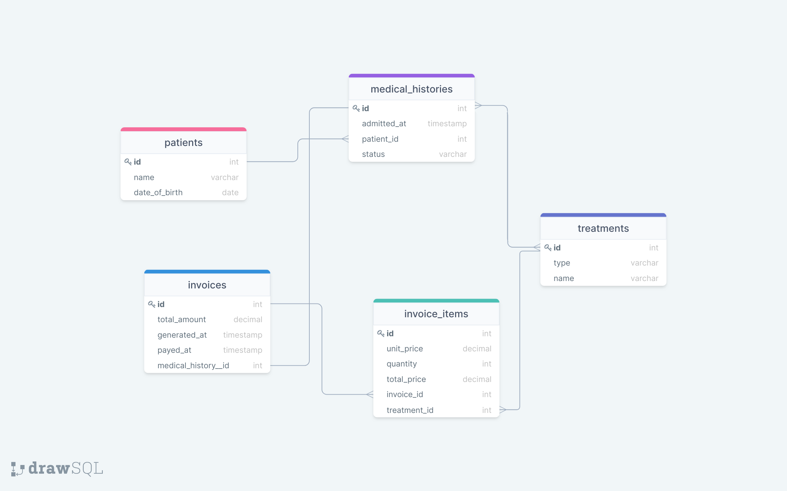

## Clinic_Database

This is a relational database to create the data structure for a clinic.

## Getting Started

This repository includes files with plain SQL that can be used to recreate a database:

- Use [schema_based_on_diagram.sql](./schema_based_on_diagram.sql) to create all tables.

## Author

👤 **Hamayoun Ali**

- GitHub: [@Hamayounali](https://github.com/Hamayounali)
- Twitter: [@hamayounAli6](https://twitter.com/hamayounAli6)
- LinkedIn: [Humayoon Ali](https://www.linkedin.com/in/humayoon-ali-663ba2239)

Alfred Boateng

- GitHub: [@learnwithalfred](https://github.com/learnwithalfred)
- Twitter: [@kb_alfred](https://twitter.com/kb_alfred)
- LinkedIn: [Alfred Boateng](https://www.linkedin.com/in/learnwithalfred/)

## 🤝 Contributing

Contributions, issues, and feature requests are welcome!

Feel free to check the [issues page](../../issues/).

## Show your support

Give a ⭐️ if you like this project!

## Acknowledgments

- Hat tip to anyone whose code was used
- Inspiration
- etc

## 📝 License

This project is [MIT](./MIT.md) licensed.
